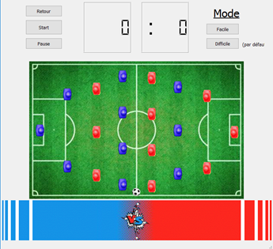

# Baby-Foot

## Description :
Dans le cadre du projet informatique, nous avons choisi le projet baby-foot. Nous ne savions pas exactement comment aborder le code au début, mais ce sujet nous a interpellé car nous souhaitions réaliser un programme que nous aurions envie d’utiliser même une fois la note rendue et le projet terminé. De plus, ce choix de projet nous permettait de nous concentrer uniquement sur les problèmes liés au code, étant donné que nous connaissions déjà les règles du jeu. Nous avons donc pu réaliser les approximations que nous souhaitions et aborder ce problème avec en tête uniquement les défis du code et le confort de jeu une fois le code finalisé.

## Principe :
Le but de notre programme était de réaliser un baby-foot virtuel jouable. Le principal était de pouvoir simuler une balle, des joueurs et un terrain de jeu grâce à une interface homme-machine. Les joueurs devaient être déplaçables grâce à l’appui sur des touches du clavier de l’ordinateur, la balle devait rebondir sur les joueurs et les murs, et les buts devaient être détectés et le score affiché sur l’interface. La balle était d'abord lancée à une vitesse V0 au milieu du plateau, avec un angle aléatoire pour qu'une équipe ou l'autre ait la balle avec une chance égale.
Nous avions pensé à diverses manières d’agrémenter notre programme, par exemple avec des images et célébrations pour les buts marqués afin de le rendre plus divertissant., ou encore avec un choix des terrains ou des balles utilisables.

  

*Pour plus de détails voir les différents rapports dans le fichier rapport.*

### *Projet réalisé en binôme avec Yanis Grillet en 2019*
