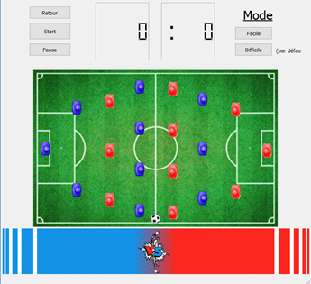

# Baby-Foot

## Objective :
Within the framework of the IT project, we chose the table soccer project. We didn't know exactly how to approach the code at the beginning, but this subject appealed to us because we wanted to create a program that we would want to use even after the note was rendered and the project was finished. Moreover, this choice of project allowed us to focus only on the problems related to the code, since we already knew the rules of the game. So we were able to make the approximations we wanted and approach this problem with only the challenges of the code in mind and the comfort of the game once the code was finalized.

## Principle :
The goal of our program was to create a playable virtual table soccer. The main thing was to be able to simulate a ball, players and a playing field thanks to a man-machine interface. The players had to be movable by pressing keys on the computer keyboard, the ball had to bounce on the players and walls, and the goals had to be detected and the score displayed on the interface. The ball was first thrown at a speed of V0 in the middle of the board, at a random angle so that one team or the other would have an equal chance of getting the ball.
We had thought of various ways to enhance our program, for example with images and celebrations for goals scored to make it more entertaining, or with a choice of usable fields or balls.

  

*For more details check the different reports in the report file.*

### *Project completed in duo with Yanis Grillet in 2019*
